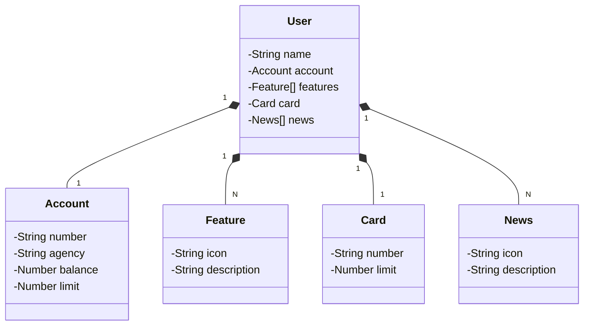

# API RESTFul para Railway
API RESTful construída com Java 17 e Spring Boot para dar deploy no Railway

## Diagrama de Classes

## Descrição do projeto
- Este projeto foi criado na aula de [deploy em Railway](https://github.com/digitalinnovationone/santander-dev-week-2023-api)
- Para fazer o deploy, é necessário ir no [Railway](https://railway.com/) e seguir os [passos](https://www.youtube.com/watch?v=wHk-b9N6Xig) necessários para o deploy.
- No meu funcionou, mas não deixarei o deploy online.

## Instalação
Após clonar e importar o repositório:
1. **(opcional)** Configure o banco de dados:
- Para facilitar, use o banco de dados H2.
- Ele está no perfil dev e está ativo por padrão.
- Como o ddl-auto está como create, todos os registros são perdidos ao iniciar o projeto.
2. **(opcional)** Caso queira ver o console do H2:
- Driver Class: org.h2.Driver
- JDBC URL: jdbc:h2:mem:testdb
- Username: sa
- Password: sa
- URL: http://localhost:8080/h2-console/
3. Execute o arquivo **ApiRestNuvemApplication** e entre no [Swagger](http://localhost:8080/swagger-ui.html).
